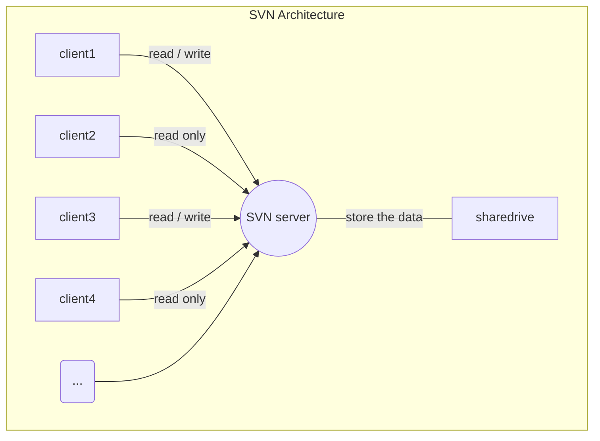

# 第2章 程序的基本结构

## 2.1 初始化

所有的 Flask 程序都必须创建一个**程序实例**。

```mermaid
graph TD
    subgraph SVN Architecture
    client1-->|read / write|SVN((SVN server))
    client2-->|read only|SVN
    client3-->|read / write|SVN
    client4-->|read only|SVN
    client5(...)-->SVN
    SVN---|store the data|sharedrive
    end
```